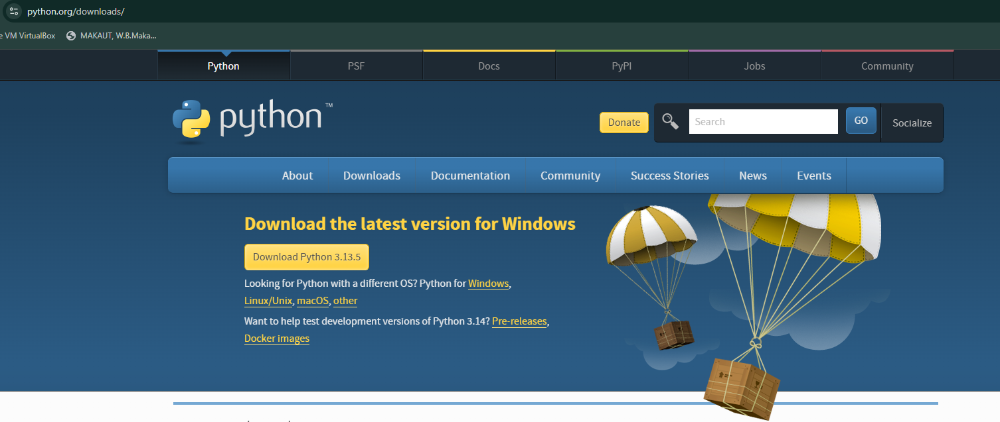

# Python Programming: Getting Started

## 🎯 Prerequisites

### Method 1: Local Installation

1. Download Python from the [official website](https://www.python.org/downloads/)



2. Verify installation:

   ```bash
   # For Windows
   python --version

   # For Mac/Linux
   python3 --version
   ```

### Method 2: Online Development

Use [Google Colab](https://colab.research.google.com/) for online Python development.


## About Python

### Writing Your First Python Code

Let's start with a simple example:


### Understanding the Output

When you run your code, you'll see the output in the console:


### Working with Files

When you create a new Python file:


The output will be displayed as:


You'll notice that Python automatically creates a new folder:


### How its Happen ?? To know the reasone We have to know about the inner Working of Python Lets Know .!!

## Understanding Python's Internal Working

### Overview


### Step-by-Step Process

1. **Compilation to Byte Code**

   - Python first compiles your code into Byte Code
   - This Byte Code is low-level and platform-independent
   - Byte Code execution is faster than direct interpretation

2. **Creation of .pyc Files**

   - The compiled bytecode is saved in .pyc files
   - These files are stored in a special directory called `__pycache__`
   - .pyc files can be thought of as frozen binaries

3. **Naming and Versioning**

   - Files in `__pycache__` include:
     - The source file name
     - The Python version (e.g., `file1.cpython-312.pyc`)
   - The version number indicates the Python version (e.g., 312 for Python 3.12)

4. **When .pyc Files Are Created**

   - .pyc files are only created for imported modules
   - They are not created for top-level executed files (like the main script you run directly)

5. **Python Virtual Machine (PVM)**

   - Python uses a component called the Python Virtual Machine (PVM)
   - The PVM:
     - Runs a code loop to interpret the bytecode
     - Acts as a runtime engine
     - Is also known as the Python Interpreter

6. **Byte Code vs Machine Code**

   - Byte Code is not Machine Code
   - It is Python-specific and still needs interpretation
   - Final execution depends on the Python interpreter implementation

7. **Python Interpreter Variants**
   - CPython (standard implementation)
   - Jython (Python on Java)
   - IronPython (Python on .NET)
   - Stackless Python
   - PyPy (faster Python using JIT)

## Next Steps

Now that you understand the basics of Python and its internal working, you're ready to start writing your own Python programs. The next sections will guide you through more advanced concepts and practical examples.
